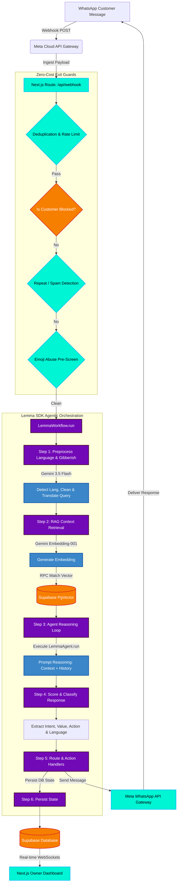

# Wapi 🧠

> **The Real-Time Agentic Intelligence Layer for WhatsApp Business.** Built for Indian SMBs, Wapi is the brain that converts flat inbox chaos into prioritized, high-value customer conversions and automated workflows.

---

<div align="center">

[](https://nextjs.org/)
[](https://www.typescriptlang.org/)
[](https://supabase.com/)
[](https://deepmind.google/technologies/gemini/)
[](https://upstash.com/)

</div>

---

## 📖 Table of Contents
1. [Core Problems Solved](#-core-problems-solved)
2. [Key Features](#-key-features)
3. [System Architecture](#-system-architecture)
4. [Tech Stack](#-tech-stack)
5. [Lemma SDK & Agentic Workflows](#-lemma-sdk--agentic-workflows)
6. [Onboarding & Quickstart](#-onboarding--quickstart)
7. [Team & Collaborators](#-team--collaborators)

---

## 🚨 Core Problems Solved

Indian SMBs process thousands of WhatsApp messages weekly. However, flat chat layouts treat a ₹500 query the same as a ₹10,000 reservation. Wapi changes this by wrapping an intelligence layer around Meta's WhatsApp Cloud API.

*   **Lead Leakage Prevention:** Automated alerts catch cold leads at critical intervals, prompting the business owner to follow up in one click.
*   **FAQ Overhead Reduction:** High-confidence questions (location, booking prices, services) are automatically answered using context-specific **RAG**, while complex requests escalate gracefully.
*   **Priority Matrixing:** The chronological inbox is replaced with an intent and estimated value (₹) queue, showing the most profitable conversations first.

---

## ✨ Key Features

*   **RAG-Driven Document Intelligence:** Upload services, prices, and policies once. Wapi generates vector embeddings via `gemini-embedding-001` and queries Supabase's `match_document_chunks` RPC.
*   **Priority Queue:** Real-time sentiment and intent classification models calculate exact conversion probabilities and transaction values (in ₹) on the fly.
*   **Multilingual Guard & Emoji Pre-Screen:** Spam, slurs, and threats are parsed in 14+ Indian languages (including Hinglish and regional dialects) at zero API costs using fast-exit validation guards.
*   **Step-by-Step Slot Filling Transactions:** Tracks customer appointments, order details, or subscription signups step-by-step from raw chat messages.
*   **Automated Nudges & Morning Summary:** Auto-drafts follow-up reminders for high-value leads and sends a summary report to the owner's WhatsApp every morning.

---

## 🏗️ System Architecture

### Message Ingestion & Execution Pipeline

The flowchart below outlines how an incoming customer message propagates through the validation guards, the Lemma SDK workflow engine, and persists to the realtime dashboard.



---

## 🛠️ Tech Stack

*   **Frontend & Dashboard:** Next.js 15, React 19, Tailwind CSS, Framer Motion, and GSAP.
*   **Backend Framework:** Next.js Server-Side Routes (Route Handlers & Edge Handlers).
*   **Database & Vector Engines:** Supabase PostgreSQL with `pgvector` for embedding matches and realtime WebSockets.
*   **AI Reasoning Core:** Google Gemini 3.5 Flash (selected for high speed, JSON schema enforcement, and cost effectiveness).
*   **Orchestration Engine:** Lemma SDK (Linked locally via `./lemma-typescript`).
*   **Spam Rate Limiter:** Upstash Redis with token bucket rate limiting.

---

## 📦 Lemma SDK & Agentic Workflows

Wapi wraps its core routing engine inside the **Lemma SDK** framework. The SDK manages context lookup, agent construction, data sync, and structured output formatting.

### 1. The Core Agent Definition (`LemmaAgent`)
Configured in `lib/lemma/agent.ts`, the agent links Supabase vector stores, Google LLM models, and database schemas with a detailed multi-agent prompt template.

```typescript
import { LemmaAgent } from "@lemma/sdk";

export const wApiAgent = new LemmaAgent({
  name: "wapi-responder",
  description: "RAG-driven AI WhatsApp support agent with confidence/intent thresholding.",
  documentStore: {
    provider: "supabase",
    table: "document_chunks",
    embeddingModel: "gemini/gemini-embedding-001",
  },
  datastore: {
    provider: "supabase",
    tables: ["conversations", "messages", "customers", "nudges"],
  },
  model: {
    provider: "google",
    name: "gemini-3.5-flash",
    apiKey: process.env.GEMINI_API_KEY!,
  },
  systemPrompt: `...` // Embedded rules for Harassment, RAG routing, and transactions.
});
```

### 2. Workflow Orchestration (`LemmaWorkflow`)
The SDK coordinates step-by-step processing blocks inside `lib/lemma/workflow.ts` to transform a raw message into a structured, routed output.

| Step | Function | Details |
| :--- | :--- | :--- |
| **`receive`** | Input capture | Records the incoming phone number, text, customer ID, and business metadata. |
| **`preprocess`** | Language & Noise validation | Detects input language, screens out keysmashes, and converts query to standard English. |
| **`retrieve-context`** | Vector Embeddings search | Requests vector embeddings and does an RPC similarity match in Supabase. |
| **`infer`** | LLM agent reasoning | Feeds document chunks, conversation history, and customer input to the LLM. |
| **`score`** | JSON extraction | Evaluates action paths, intent scores, estimated values, and transaction details. |
| **`route`** | Decision routing | Decides if the message should be deflected, answered, blocked, or escalated. |
| **`persist`** | DB Synchronization | Syncs final message properties to the Supabase database. |

---

## 🚀 Onboarding & Quickstart

### Prerequisites
*   Node.js v20+
*   Supabase Account & PostgreSQL Instance
*   Gemini API Key
*   Meta Developer Account (for Cloud WhatsApp API credentials)

### Environment Configuration
Create a `.env.local` file in the root directory:
```env
NEXT_PUBLIC_SUPABASE_URL=your_supabase_url
SUPABASE_SERVICE_ROLE_KEY=your_supabase_admin_key
GEMINI_API_KEY=your_gemini_api_key
WHATSAPP_VERIFY_TOKEN=your_webhook_verification_token
WHATSAPP_APP_SECRET=your_whatsapp_app_secret
WHATSAPP_ACCESS_TOKEN=your_meta_system_user_access_token
```

### Installation
1. Install dependencies:
   ```bash
   npm install
   ```
2. Run database migrations inside Supabase to prepare the schemas (`transactions`, `businesses`, `messages`).
3. Start the local development server:
   ```bash
   npm run dev
   ```

---

## 👥 Team & Collaborators

<div align="center">
  <table border="0" style="border-collapse: collapse; border: none; background: transparent;">
    <tr>
      <!-- Kritika Card -->
      <td align="center" width="280" style="background-color: #0c1216; border: 1px solid #1a2936; border-radius: 16px; padding: 24px; box-shadow: 0 4px 30px rgba(0, 0, 0, 0.2); margin: 10px;">
        
        <br/><br/>
        <strong style="color: #ffffff; font-size: 1.15rem; font-family: 'Space Grotesk', sans-serif; letter-spacing: 0.5px;">Kritika Benjwal</strong>
        <br/><br/>
        <table border="0" style="border-collapse: collapse; border: none; background: transparent;">
          <tr>
            <td align="center" style="padding: 4px 0;">
              <a href="https://github.com/Kritika11052005" target="_blank">
                
              </a>
            </td>
          </tr>
          <tr>
            <td align="center" style="padding: 4px 0;">
              <a href="mailto:ananaya.benjwal@gmail.com">
                
              </a>
            </td>
          </tr>
          <tr>
            <td align="center" style="padding: 4px 0;">
              <a href="https://www.linkedin.com/in/kritika-benjwal" target="_blank">
                
              </a>
            </td>
          </tr>
        </table>
      </td>
      <!-- Sarthak Card -->
      <td align="center" width="280" style="background-color: #0c1216; border: 1px solid #1a2936; border-radius: 16px; padding: 24px; box-shadow: 0 4px 30px rgba(0, 0, 0, 0.2); margin: 10px;">
        
        <br/><br/>
        <strong style="color: #ffffff; font-size: 1.15rem; font-family: 'Space Grotesk', sans-serif; letter-spacing: 0.5px;">Sarthak Gupta</strong>
        <br/><br/>
        <table border="0" style="border-collapse: collapse; border: none; background: transparent;">
          <tr>
            <td align="center" style="padding: 4px 0;">
              <a href="https://github.com/SarthakG1801" target="_blank">
                
              </a>
            </td>
          </tr>
          <tr>
            <td align="center" style="padding: 4px 0;">
              <a href="mailto:sarthakgupta1971@gmail.com">
                
              </a>
            </td>
          </tr>
          <tr>
            <td align="center" style="padding: 4px 0;">
              <a href="https://www.linkedin.com/in/sarthakgupta1801" target="_blank">
                
              </a>
            </td>
          </tr>
        </table>
      </td>
    </tr>
  </table>
</div>
